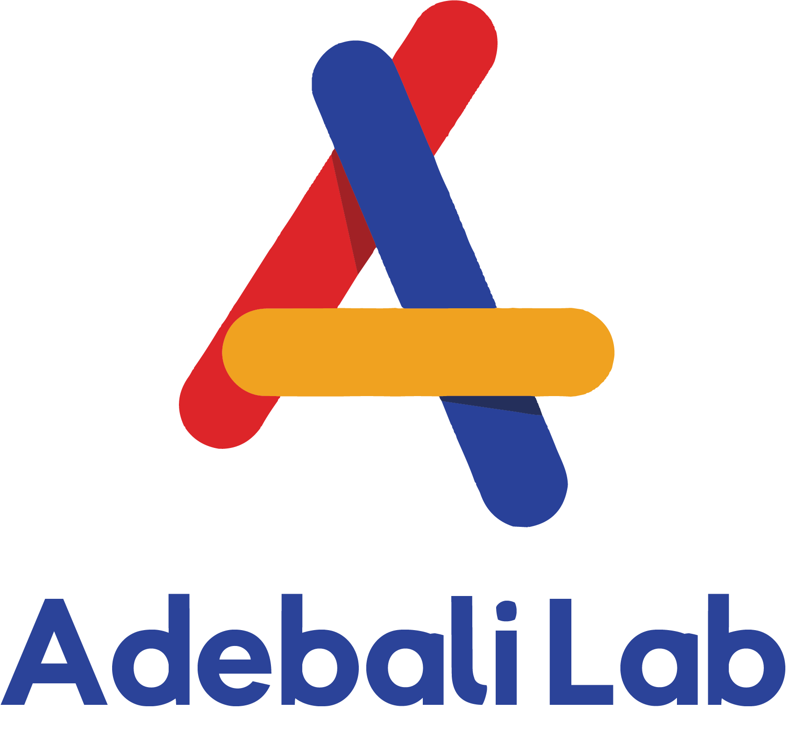

# 

# About `Phylostat`

Phylostat is a web app and library for visualising phylogenetic trees and analyzing the clade divergence patterns. [More]( "./help.html")

## Developed by

## Cite

## Licence

MIT licence.

## Contact

oadebali@sabanciuniv.edu

## Source code 

https://github.com/compGenomeLab/phylostat

## Issues

Please create your issues at https://github.com/compGenomeLab/phylostat/issues

## Credits

[phylo.io](phylo.io) by Dessimoz lab.

## Acknowledgement

Omer Karamanli implemented the algorithm developed by Ogun Adebali in the scope of his graduation project.

