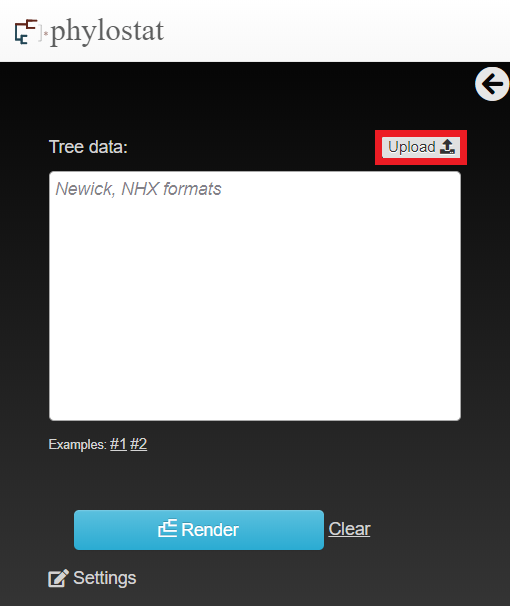
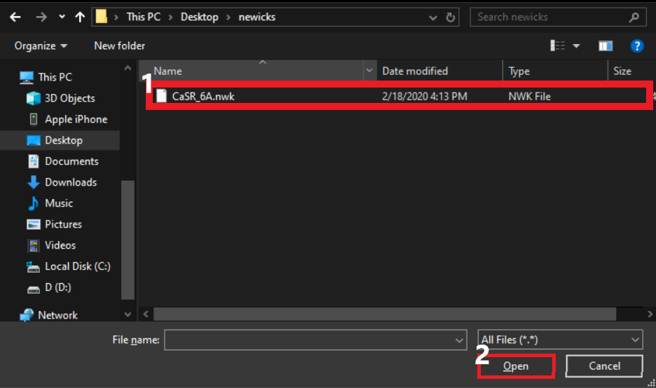
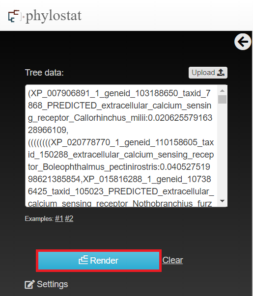
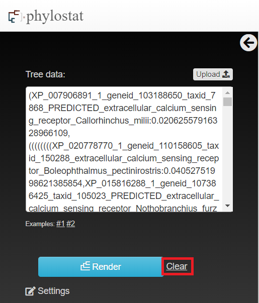
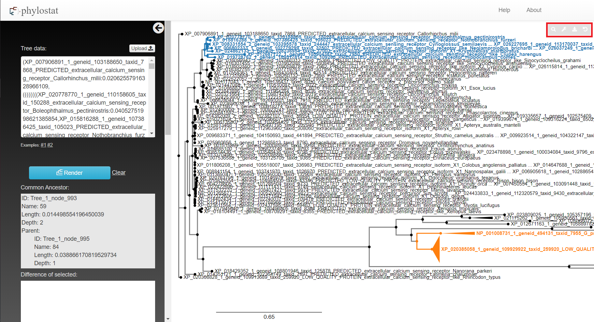

# 

# Phylostat Manual

[< Back to phylostat]( "./index.html")

## Introduction
Phylostat is a tool for visualising phylogenetic trees on the web. It can be used to view a tree and analyzing the clade divergence patterns. Phylostat includes useful features to make the viewing and analyzing of even very large trees extremely easy.

## Phylogenetic Tree Generation
To generate and view a tree, simply put your Newick code for the tree in designated area as shown in figures. 

 

You can also use upload .nwk files for your tree as shown.

 

Then simply press render button to render yor tree.

To clear everything, click on clear.

After clicking render button, you will be able to see your tree as shown in figure 7.

You can have sidebar menu hidden by clicking the arrow on its right upper corner.

To make it visible, simply click on the arrow again.
## Node Interaction
After rendering a tree, you can interact with nodes/clades.
When you hover your mouse over a node, it will highlight all the nodes from hovered over node to leaves as shown in the next figure.

After clicking on a node, there will be some options available. 
* You can collapse the branches of selected node into the selected node. 
* You can select collapse all which will collapse all children into their parent node under the selected node. 
* You can choose to expand which will expand selected node by 1 length. 
* You can choose expand all which will expand everything under the selected node. 
* You can swap subtrees which switches positions of subtrees of the selected node. 
* And, you can select the node to do further analyzing.

 

After selected a node as first selection, the node and its all branches will be recolored into blue.

A node and its all branches will be recolored into orange if it was selected as second node to do analyzing.

You can remove a selection or all the selections. If you click on previously selected node, there is an option to remove that selection. If you click on any node, there is an option to remove all selections once you select two nodes.

## Interpretation
After selecting the nodes that you want to do analysis on, you can see that there are some information on the sidebar menu. 
First, you can see their common ancestor node and information on that node. Its ID, name, length, depth and same information of its parent. 

After that, there are 2 set of box plots. 
* First one shows distance difference of selected nodes' leaves with their common ancestor node. Right below that, you can see t-test score of those differences and p-value.

* Second one shows distance of each nodes' leaves with eachother. As in blue plot shows differences of the first selected node's leaves' distance difference with eachother and orange plot shows differences of the second selected node's leaves' distance difference with eachother. Right below those plots, you can see t-test score of those differences with eachother and p-value.

Then there is a search option. It searches with Regular Expression in nodes. When it is left blank, it will search for same taxIds as default and will show search results with a venn diagram. You can enter custom RegEx to do a search. Examples of when it is left blank and when entered a custom RegEx is shown below.

  

## Visualization Features
There are settings that changes the visualization of the tree.

* You can change the minimum depth of nodes that auto-collapse.
* You can put internal labels to paths. 
   * None: Default one. Nothings is shown. 
   * Branch Labels/Support: Shows branch labels.
   * Length: Shows the length of that path.
* You can adjust line thickness, node size and text size.
* When "Use Lengths" is check, tree panths will be rendered according to their lengths. Otherwise, they will be all same length.
* When "Align tip labels" is checked, leaves will be aligned at the bottom and visual path lengths will be changed.
* "Mirror right tree" and "Move To Best Corresponding Node on Highlight Click" does not have any effects.
* When "Select multiple search results" is clicked you can select more than one search result in the search results dropdown menu. Otherwise, you will be able to select only one.

There are more options on the right upper corner of the screen.

* With clicking search button you can search for specific leaf nodes. This will search for node names and will highlight matching nodes in purple. Also, it will drop down a menu of matching node names as search results/auto complete.
* You can resize your tree with settings button. There is option to rescale the tree. You can select the level of zoom and you can ladderize your tree in ascending("asc") or descending("desc") order.
* You can export your tree  with download button as .nwk .svg or .png file. Online sharing feature is currently not working.
* Or you can undo your last change on the tree with undo button. 
