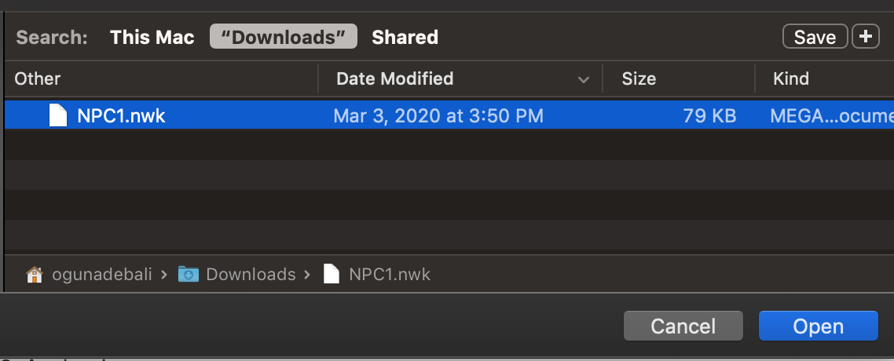
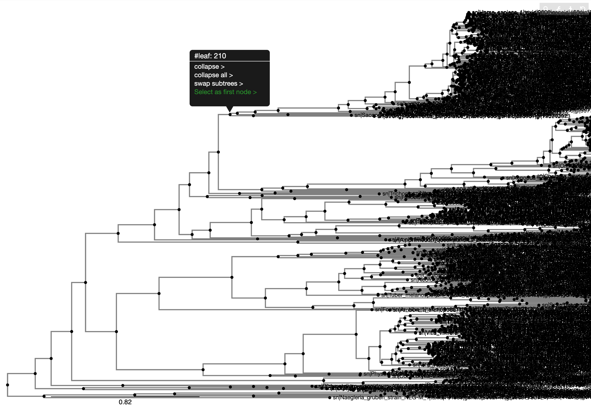
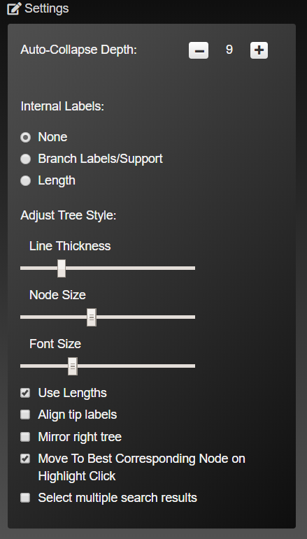

# 

# Phylostat Manual

[< Back to phylostat]( "./index.html")

## Introduction
Phylostat is a web-based tool for visualising and analyzing phylogenetic trees. It can be used to view a tree and analyzing the clade divergence patterns. Phylostat includes compares two paralogous clades, the genetic entities sharing homology due to a gene duplication evet, and suggests whether they are differentially diverged or not. If they are differentially diverged, it proposes one of the clades to have conserved the ancestral function.

## Phylogenetic Tree Generation
To generate and view a tree, simply put (copy & paste or upload) your tree in Newick format for the tree in designated area as shown in figures. 

</img>

*Designated tree text are that users can copy and paste or upload their phylogenetic tree to be analyzed*

</img>

*Select the upload option for large trees in `.nwk` format*

</img>

*Click on `Render` to visualize the tree*

</img>

*Example tree - as visualized. The large trees can be zoomed in in order to reveal the details*

## Node Interaction
After rendering a tree, you can interact with nodes/clades.
When you hover your mouse over a node, it will highlight all the nodes from hovered over node to leaves as shown in the next figure.

After clicking on a node, there will be some options available. 
* You can collapse the branches of selected node into the selected node. 
* You can select collapse all which will collapse all children into their parent node under the selected node. 
* You can choose to expand which will expand selected node by 1 length. 
* You can choose expand all which will expand everything under the selected node. 
* You can swap subtrees which switches positions of subtrees of the selected node. 
* And, you can select the node to do further analyzing.

</img>

*Selection of the first clade to be compared. The node selected as the "first node" will be compared to the second node/clade to be selected. The first clade will be reffered as `Node 1`*

After selected a node as first selection, the node and its all branches will be recolored into blue.

</img>

*Selected first node. The first clade will be represented in blue. It is always possible to clear selection if you want to change the clade that you may want to select.*

</img>

*Selection of the second node/clade*
The selected node, its all branches as well as leaves will be recolored into orange if it was selected as second node to do analyzing.

</img>

*Both nodes are selected. First and second nodes are colored in blue and orange, respectively*

You can remove a selection or all the selections. If you click on previously selected node, there is an option to remove that selection. If you click on any node, there is an option to remove all selections once you select two nodes.

## Interpretation
After selecting the nodes that you want to do analysis on, you can see additional rendered sections on the sidebar menu. 

First, you can see their common ancestor node and information on that node. Its ID, name, length, depth and same information of its parent. 

</img>

After that, box plots is generated which corresponds to the visualization of internal difference of the leaves with statistical test values:

</img>

Then there is a search option. It searches with Regular Expression in nodes. When it is left blank, it will search for same taxIds as default and will show search results with a venn diagram. You can enter custom RegEx to do a search. Examples of when it is left blank and when entered a custom RegEx is shown below.

</img>

*RegEx examples with leaf names :*

Leaf name: sp_P28069_PIT1_HUMAN_9606 RegEx: _[0-9]{4,} (catches the taxaid’s in the end)

Leaf name: tr|H2PYM2lH2PY_PANTR_ZMYM4_isoform_1_OS_Pan_troglodytes_OX_(cont’) RegEx: _OS[A-z_]* (catches the taxa name after OS)

## Visualization Features
There are settings that changes the visualization of the tree.

</img>

* You can change the minimum depth of nodes that auto-collapse.
* You can put internal labels to paths. 
   * None: Default one. Nothings is shown. 
   * Branch Labels/Support: Shows branch labels.
   * Length: Shows the length of that path.
* You can adjust line thickness, node size and text size.
* When "Use Lengths" is check, tree panths will be rendered according to their lengths. Otherwise, they will be all same length.
* When "Align tip labels" is checked, leaves will be aligned at the bottom and visual path lengths will be changed.
* "Mirror right tree" and "Move To Best Corresponding Node on Highlight Click" does not have any effects.
* When "Select multiple search results" is clicked you can select more than one search result in the search results dropdown menu. Otherwise, you will be able to select only one.

There are more options on the right upper corner of the screen.
</img>

* With clicking search button you can search for specific leaf nodes. This will search for node names and will highlight matching nodes in purple. Also, it will drop down a menu of matching node names as search results/auto complete.
* You can resize your tree with settings button. There is option to rescale the tree. You can select the level of zoom and you can ladderize your tree in ascending("asc") or descending("desc") order.
* You can export your tree  with download button as `.nwk` `.svg` or `.png` file. Online sharing feature is currently not working.
* Or you can undo your last change on the tree with undo button. 
